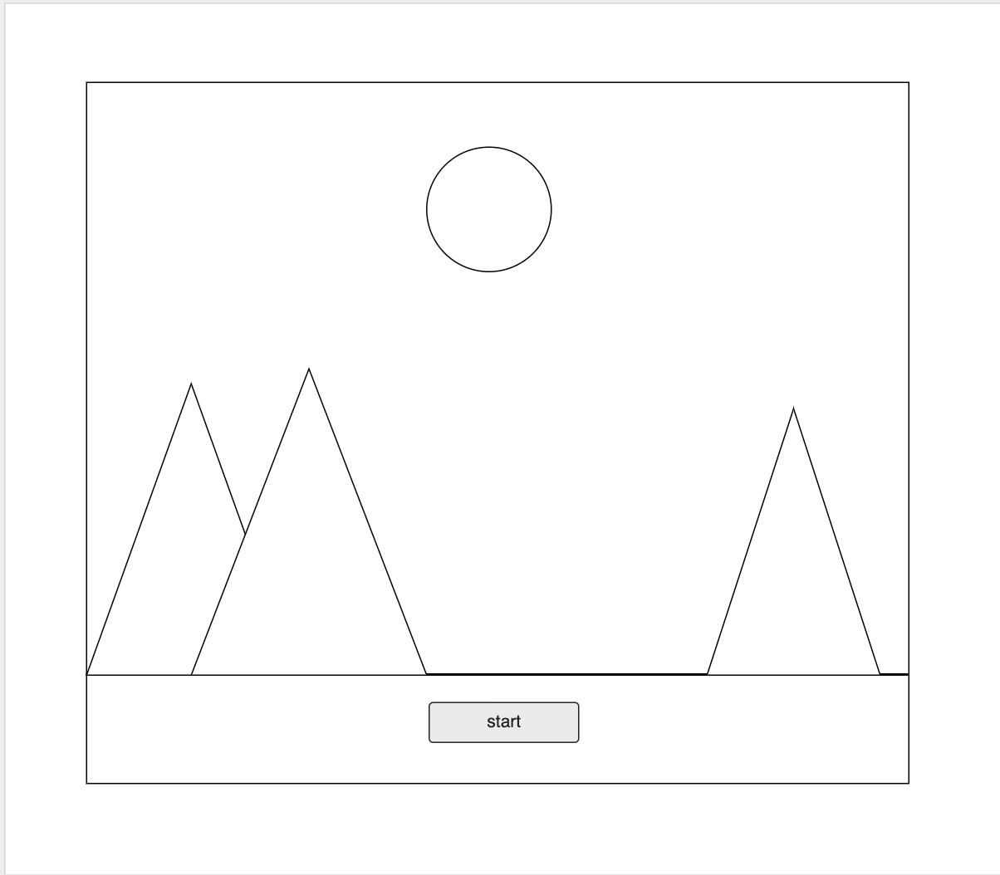
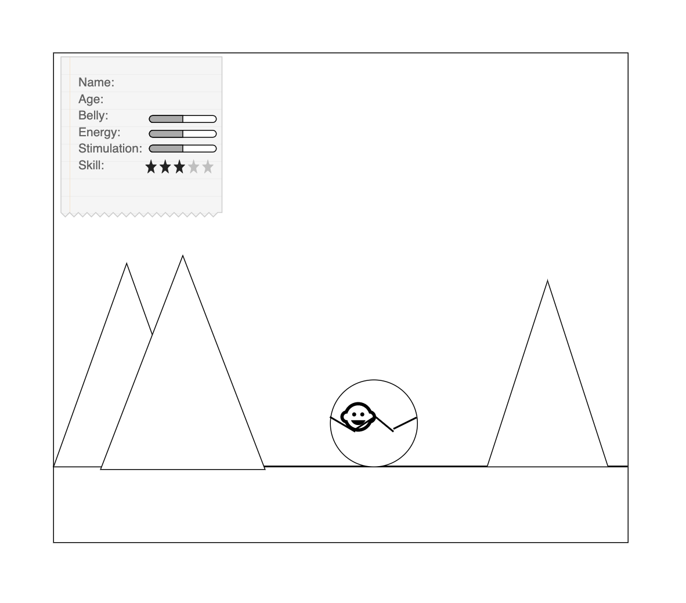
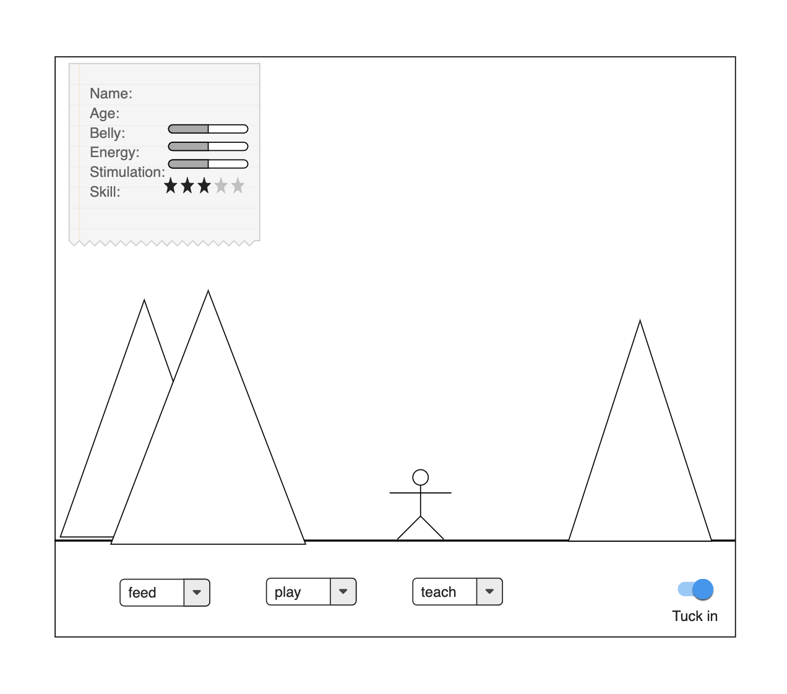
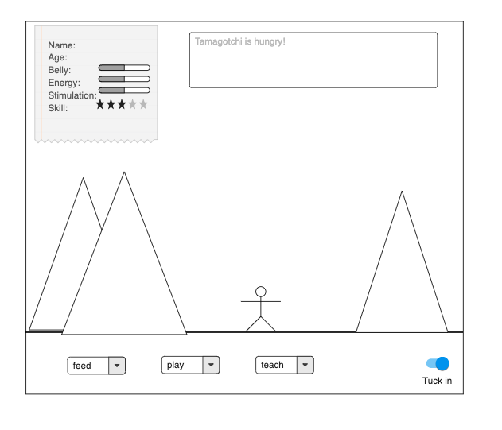
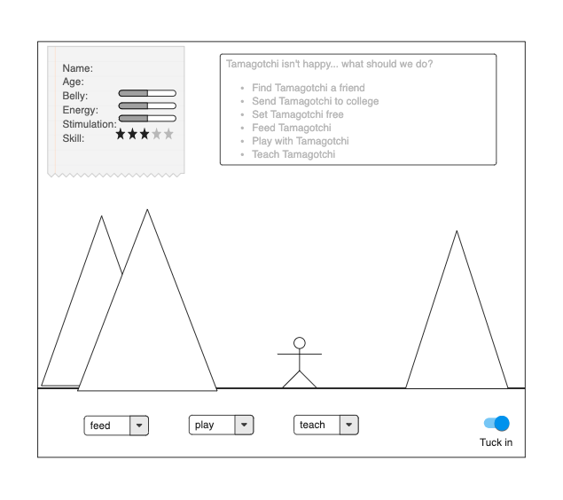

# Project 0 ~~ Tamagotchi

## Introduction

## User Story

- When the user clicks start, Tamagotchi is born. The user can give Tamagotchi a new name, and stats are displayed.
- Tamagotchi's stats change with time and as the user interacts with them by feeding, playing with, and teaching it.
- Tamagotchi's age increases after being tucked in, and rate of boredom and hunger increase while sleepiness decreases.
- If Tamagotchi is too hungry, sleepy, or bored, they sleep forever and can't wake up.
- Once Tamagotchi is a certain age, they become restless and the user must find out what they want.

## Wireframes

### Start Screen ~ Tamagotchi Is Born!

### Interact With Tamagotchi
User chooses from interactions options and affects Tamagotchi's stats.

### Tamagotchi Tells How It Feels
Tamagotchi can communicate how they feel through body language and the narrative box.

## Tamagotchi's Needs Change
At a certain age, Tamagotchi's needs change and the user must figure out what they want.

